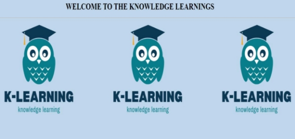
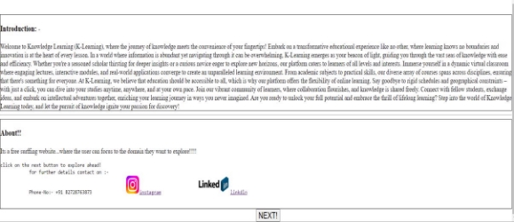
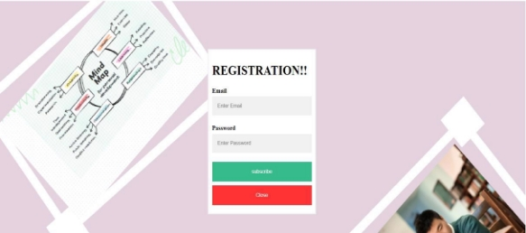

**WELCOME TO KNOWLEDGE LEARNING (K-LEARNING)** 

**NOTE: - This is to bring in the visitors notice that the site has been completed for the university project purpose...the resources on the website has been taken from online sources such as: -**  

**Youtube, google images...** 

**INFORMATION ABOUT THE WEBSITE: - This website is an identity to YouTube...which provides a learning platform to its user...at the very initial phase this website provides its user a sense of online videographic learnings same as the YouTube does...** 

**The website includes the following languages: -** 

**1.>HTML (HYPERTEXT MARKUP LANGUAGE) 2.>CSS (CASCADING STYLING SHEET) 3.>JAVASCRIPT (includes AngularJS) 4.>NodeJS**  

**Here are some glimpses of the website along with the language definition used: -**

The above image interacts with the website users to the initial when they open the website. This gives them a small introduction to the website.  

The languages it follows are HTML and CSS. 

The languages used for the above page are 

- HTML,  
- CSS, 
- JavaScript and 
- AngularJS. 

The language used for the above images are:  

- HTML 
- CSS 
- JavaScript 
- Node 
